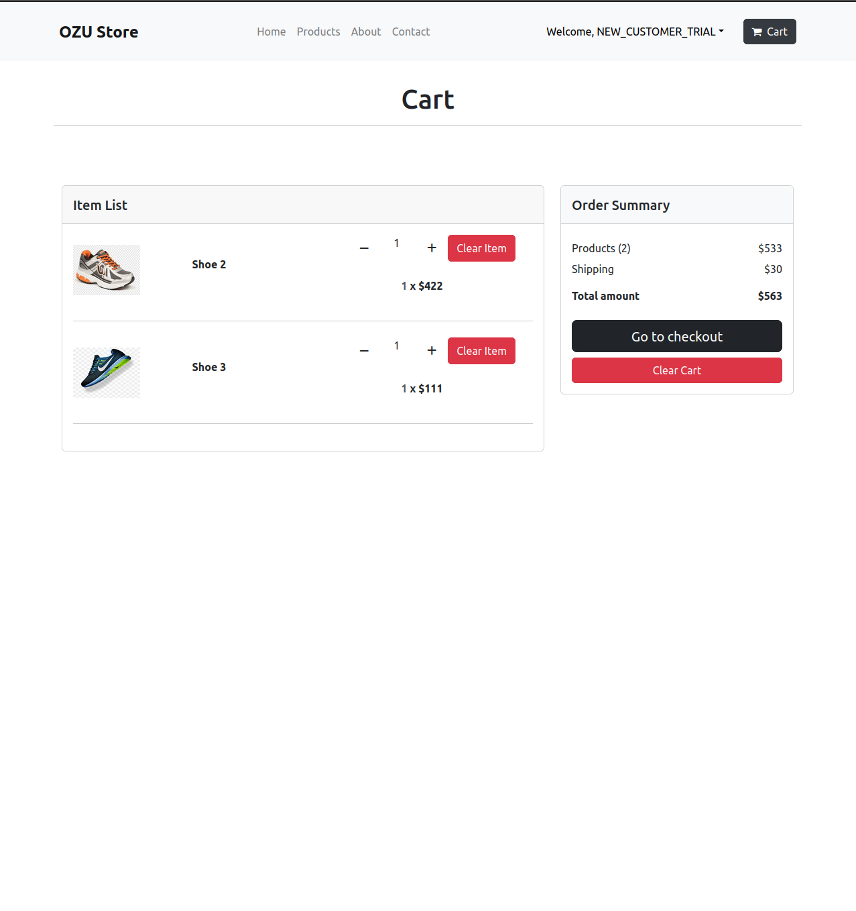
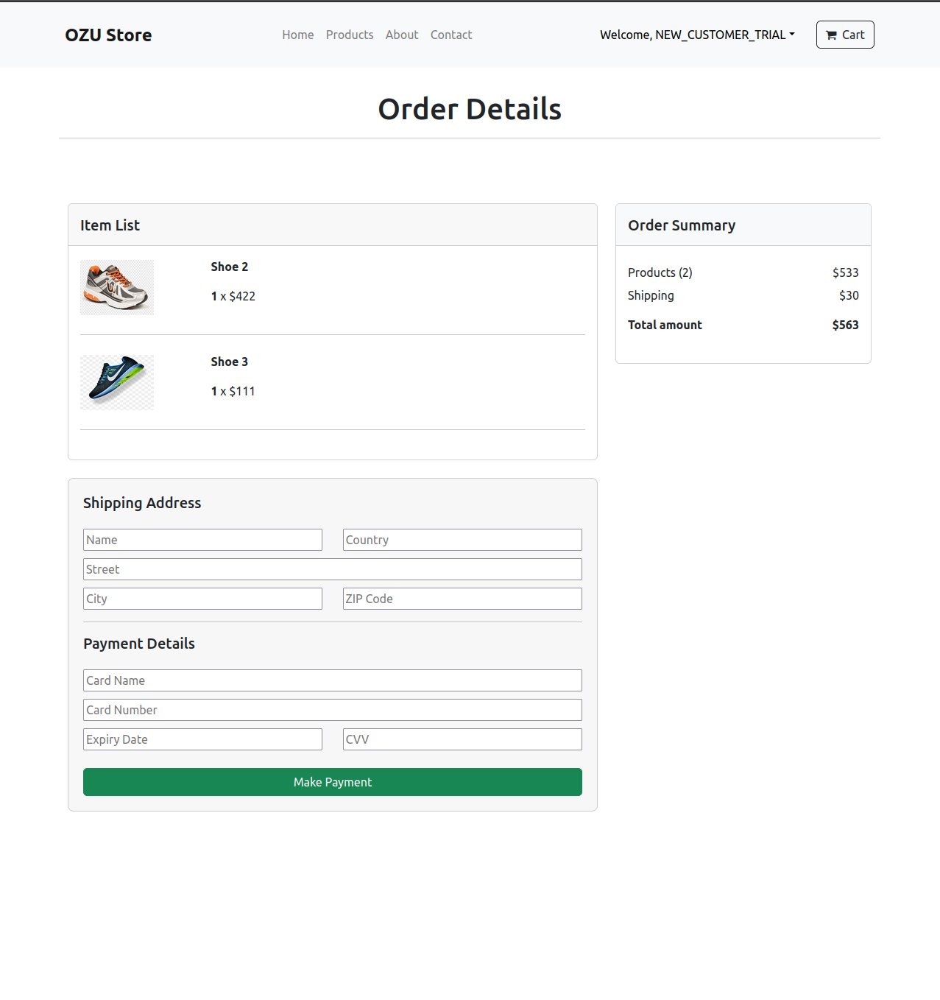

# E-Commerce Website Project

This project is an e-commerce website developed as part of a school assignment. It showcases a simple yet functional online store, where users can browse products, search for items, and manage their accounts.

## Technologies Used

- **React**: For the frontend user interface.
- **Django**: For the backend server and API.
- **SQLite**: For the database.

## How to Run the Project

### Starting the Backend

1. Navigate to the backend directory:
    ```sh
    cd backend/
    ```
2. Start the Django server:
    ```sh
    python3 manage.py runserver
    ```

### Starting the Frontend

1. Navigate to the frontend directory:
    ```sh
    cd frontend/
    ```
2. Install the necessary npm packages:
    ```sh
    npm install
    ```
3. Start the React application:
    ```sh
    npm start
    ```

### Accessing the Admin Panels

- To access the Django admin dashboard, go to: `http://localhost:8000/admin/`
- To access the website admin panel, go to: `http://localhost:3000/`

- If you want to create a superuser, use the following command:
    ```sh
    python3 manage.py createsuperuser
    ```

## Features

- Store owners can add, edit, or delete products.
- Customers can purchase products and receive product information via email.
- Products can be reviewed by customers.

### Note:
For mail operations, you need to edit the section in `settings.py` according to your own email configuration.

## Images

<p>


</p>
<p>
Login page for user authentication. | Adding a new product to the store.
</p>

<p>


</p>
<p>
Customers leaving comments on products. | Another view of product comments.
</p>

<p>


</p>
<p>
Detailed view of a product. | List of products available in the store.
</p>

<p>


</p>
<p>
Overview of all products. | User's purchase history.
</p>

<p>


</p>
<p>
Registration page for new users. | User's shopping basket.
</p>

<p>


</p>
<p>
Checkout process for purchasing products. | Editing an existing product.
</p>

## Acknowledgements

Front-end design is inspired by the [React_E-Commerce](https://github.com/ssahibsingh/React_E-Commerce) repository.

Thank you for the assistance.
